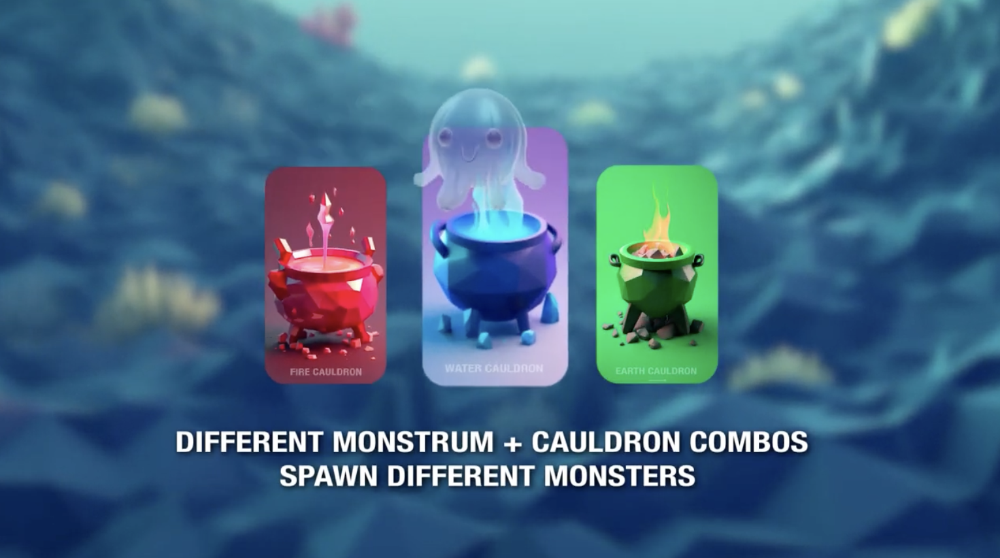

# 🏆 Mojo Monsters

## 2nd Place Winner - Aptos Hack Holland 2023


## Project Overview

Mojo Monsters is a blockchain-based monster collection and breeding game built on the Aptos blockchain. Players can create, collect, breed, and trade unique digital monsters with various traits and elemental properties.

## Video Demo

[](https://youtu.be/hVXkSA5kPQk)

Click the image above to watch the video demo of Mojo Monsters in action! See how players can create, infuse, and breed unique monsters using our innovative blockchain mechanics.

### Key Features:
- **Monster Creation**: Create "Monstrums" with unique traits and properties
- **Elemental Infusion**: Infuse monsters with different elemental properties (Fire, Water, Earth) using cauldrons
- **Monster Breeding**: Breed monsters together to create new ones with combined or mutated traits
- **Monster Collection**: View and interact with your monster collection
- **Trading System**: Trade monsters with other players
- **Augmented Reality**: View your monsters in AR using Apple's USDZ format

### Technologies:
- **Frontend**: Next.js, Tailwind CSS
- **Blockchain**: Aptos blockchain using Move language
- **AR**: Apple's USDZ format for AR experiences

## Hackathon Achievement

Mojo Monsters won **2nd place** at the [Aptos Hack Holland 2023](https://aptosfoundation.org/events/hack-holland-2023) hackathon held in Amsterdam from June 5-7, 2023. The project competed against teams from around the world and secured a $20,000 prize in the NFTs, social, and gaming track.

The hackathon was judged on the following criteria:
- Aptos Blockchain Utilization (30%)
- Technical Merit (20%)
- Innovation (20%)
- Project Completeness (20%)
- Future Potential (10%)

Our project stood out for its innovative use of Move language for complex breeding mechanics and elemental transformation of monster traits, combined with an engaging user interface and AR integration.

## Technical Details

### Smart Contract Architecture

The core of Mojo Monsters is built on Move language smart contracts that handle the creation, infusion, and breeding mechanics:

#### Monster Traits System
Monsters have two core components:
- **Jelly Core**: Defines physical traits (Ferocious, Solid, Swift, Adaptive)
- **Joose Core**: Defines elemental properties (Fire, Water, Earth)

#### Key Smart Contract Functions

1. **Monster Creation**:
   ```move
   fun create_monstrum<T0, T1>(
     creator: &signer,
     name: String,
     token_uri: String,
   ): ConstructorRef
   ```
   Creates a new monster with generic type parameters for traits.

2. **Elemental Infusion**:
   ```move
   fun infuse_monstrum<T0, T1, T2>(
     creator: &signer,
     monstrum_object: Object<Monstrum<T0, T1>>,
     cauldron_object: Object<Cauldron<T2>>,
   )
   ```
   Transforms a monster by infusing it with properties from a specific cauldron type.

3. **Monster Breeding**:
   ```move
   fun breed<T0, T1, T2, T3>(
     creator: &signer,
     monster1: &Object<Monster<T0, T1>>,
     monster2: &Object<Monster<T2, T3>>,
     token_uri: String,
   ): address
   ```
   Creates a new monster by combining traits from two parent monsters.

> **Note**: For a more detailed explanation of the smart contract implementation, see the [contracts/README.md](contracts/README.md) file.

### Frontend Architecture

The frontend is built with Next.js and features three main interfaces:

1. **Main Page**: Shows a petri dish with spores and various cauldrons for elemental infusion
2. **Monster Detail Page**: For viewing and interacting with a specific monster
3. **Mingle Page**: Interface for breeding monsters together

### Augmented Reality Integration

The project includes AR functionality using Apple's USDZ format, allowing users to view their monsters in augmented reality on compatible devices. The integration is handled via:
- USDZ model files for 3D monster representations
- HTML redirect for AR view launching

### Type System and Game Mechanics

The Move smart contract uses a sophisticated generic type system to represent monster genetics and elemental properties. The breeding mechanics use type constraints to determine resulting monster traits based on parent combinations.

## Future Development

This project was built within the constraints of a 3-day hackathon. Future development plans include:
- Enhanced gameplay mechanics with monster battles
- Expanded trait system with more elemental types
- Marketplace integration for monster trading
- Mobile-optimized experience
- Multi-chain support 